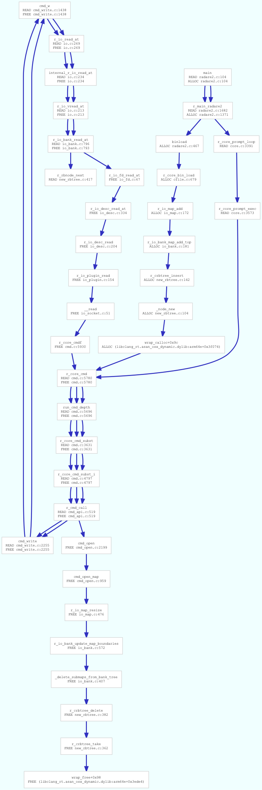

# ASAN crashlog parser and visualization

This typescript program is designed to run inside radare2 using the new QJS
runtime and the high level r2papi API.

--pancake

## How to use

Run `make` to get the r2papi installed and genreate the .qjs file.

The crash.txt file contains the output from ASAN, this file is loaded using
the r2.cmd("cat") API call, calls the parsing function which walks the
backtraces, merging the paths creating edges and registering how the
offending variable is accessed (READ, WRITE, ALLOC or FREE).

```sh
r2 -qi asan.ts - > a.dot
dot -Tpng < a.dot > a.png
```

Uncoment the last line if you want the ascii art graph instead

## How it looks


